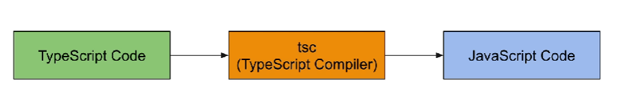
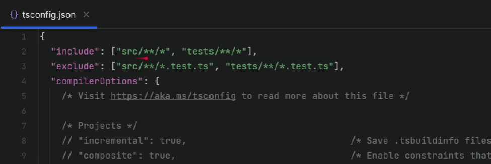

# Typescript Dasar

## Sebelum Belajar
* Javascript
* NodeJS

## Pengenalan TypeScript
* TypeScript adalah bahasa pemrograman berorientasi objek yang dibuat oleh Microsoft
* TypeScript adalah bahasa pemrograman yang dikompilasi menjadi kode Javascript
* Menggunakan Typescript akan membuat kode kita lebih mudah dibaca dan di debug dibandingkan menggunakan Javascript
* Typescript adalah bahasa pemrograman yang Strongly Type (seperti Java, C#, dan C/C++)
* [Dokumentasi Typescript](https://www.typescriptlang.org/)

### Proses Development TypeScript
 <br>

### Keuntungan Belajar TypeScript
* Saat ini banyak sekali perusahaan yang mengadopsi TypeScript, hal ini karena banyak fitur yang dimiliki oleh TypeScript yang sangat memudahkan saat proses pemrograman aplikasi
* Karena TypeScript melakukan kompilasi kode menjadi Javascript, hal ini secara otomatis kita tidak perlu lagi pusing dengan fitur-fitur di Javascript yang belum di support, karena Typescript secara otomatis akan mengurusnya
* Selain itu, banyak juga framework-framework yang populer sekarang mulai beralih menggunakan Typescript, seperti ReactJS, VueJS, NestJS, dan lain-lain.

### Membuat Project
* Buat folder belajar-typescript-dasar
* `npm init`
* Buka package.json dan tambah type module

### Menambah Library Jest untuk Unit Test
* `npm install --save-dev jest@types/jest`
* sepertinya bisa menggunakan `npm i @types/jest`
* [Dokumentasi Jest](https://www.npmjs.com/package/jest)

### Menambah Library Babel
* `npm install --save-dev babel-jest @babel/preset-env`
* [Dokumentasi](https://babeljs.io/setup#installation)

### Setup TypeScript Project
* `npm install --save-dev typescript`
* [Dokumentasi](https://www.npmjs.com/package/typescript)
<br>

* `npx tsc --init`
* Semua konfigurasi akan dibuat di file tsconfig.json
* Ubah "module" dari "commonjs" menjadi "ES6"

### Setup TypeScript untuk Jest
[Dokumentasi Jest](https://jestjs.io/docs/getting-started#using-typescript)


## Say Hello Function
* Sebelum mulai belajar, kita akan coba buat say hello function dengan file TypeScript
* Kode: src/say-hello.ts
* Kode: tests/say-hello.test.ts
* Untuk menjalankan semua tests bisa dengan `npm test`
* Atau bisa secara spesifik: `jest nama-file.test.ts`

## Kompilasi TypeScript
* Seperti yang dijelaskan di awal, bahwa kode TypeScript tidak bisa langsung dijalankan, kita harus melakukan kompilasi terlebih dahulu menjadi Javascript
* Kita bisa menggunakan perintah: `npx tsc`
* Secara default, semua file hasil kompilasi akan disimpan di lokasi yang sama dengan file Typescript
* Kadang, praktek programmer Typescript biasanya memisahkan lokasi hasil kompilasi ke sebuah folder misal dist (distribution)
* Untuk mengubah lokasi file hasil kompilasi, kita perlu ubah di tsconfig.jsonm dibagian `"outDir": "dist/"`
* Jika ada error pada kode Typescript maka tidak akan bisa dicompile ke Javascript

### Include dan Exclue
* Secara default, semua file ts akan coba dikompilasi oleh TypeScript, kadang-kadang kita tidak membutuhkan hal tersebut
* Misal kita hanya ingin melakukan kompilasi untuk kdoe program dan tidak butuh melakukan kompilasi untuk kode unit test
* Kita bisa tambahkan include dan exclue pada tsconfig.json nya
* [Dokumentasi Include](https://www.typescriptlang.org/tsconfig#include) -- (sebutkan folder mana saja yang mau kita include)
* [Dokumentasi Exclude](https://www.typescriptlang.org/tsconfig#exclude) -- (sebutkan folder mana saja yang mau kita exclude)

### Kode: Include dan Exclude
 <br>

`"include" : ["src/**/*"],` <br>
`"exclude" : ["test/**/*"],` <br>

Yang akan dicompile hanya folder src. Tapi karena sedang belajar, maka lebih baik folder test ikut dicompile.


## Tipe Data Primitif
* TypeScript menggunakan tipe data di Javascript, sehingga semua tipe data seperti string, number, boolean otomatis didukung oleh Typescript

### Daftar Tipe Data Primitif
| Tipe Data Primitif | Keterangan |
| ------------------ | ---------- | 
| number             | Number di Javascript |
| boolean            | Boolean di Javascript |
| string             | String di Javascript |

### Deklarasi Variabel
* Karena Typescript adalah Strongly Type Language, oleh karena itu saat kita membuat variabel, kita harus menentukan tipe data variabelnya
* Dan jika kita sudah menentukan tipe datanya, kita tidak boleh mengubah variabel tersebut menjadi tipe data yang berbeda
* Typescript bisa secara otomatis mendeteksi tipe data yang sedang digunakan, tapi kita juga bisa menentukan secarra eksplisit menggunakan: `const namaVariable: tipedata = value`
* file: tests/tipe-data.test.ts


## Babel TypeScript
* Untuk menjalankan unit test, kita menggunakan Jest dan Babel
* Banyak programmer Typescript yang mengeluh ketika proses development, menggunakan Typescript lebih lambat karena harus melakukan kompilasi terlebih dahulu
* Oleh karena itu, @babel/typescript melakukan cara kompilasinya dengan cara menghapus kode Typescript dan menjadikan kode Javascript, hal ini memang lucu, tapi inilah kenyataannya.
* Oleh karena itu, error Typescript yang sering harusnya terjadi di Unit Test kadang tidak terjadi karena kode Typescript dihapus oleh Babel
* Oleh karena itu, kita harus secara regular melakukan pengecekan perintah menggunakan perintah: `npx tsc`
* Untuk memastikan tidak ada kode Typescript kita yang bermasalah

### Kode: Error TypeScript

```typescript
let name: string = "Jeremyas Cornelis Abigail Wihardjono"

let balance: number = 1000000;

let isVip: boolean = true;

console.info(name);
console.info(balance);
console.info(isVip);

name = 1; // error
balance = "1000000"; // error
isVip = 1; // error

```

Saat coba di compile ke Javascript, pasti error. Tapi saat jalankan unit test nya, ini pasti sukses. Kenapa? Karena kode typescript di atas akan dihapus dan digantikan kode Javascript oleh Babel. <br>

Jadi berhati-hatilah. Saat membuat kode Typescript, pastikan jangan cuma mengecek menggunakan jest atau babel nya. Pastikan juga dengan melakukan kompilasi untuk mengetahui apakah ada error tersisa atau tidak.

Sebenarnya ada cara yang lebih mudah, yaitu dengan **typescript compiler**

### TypeScript Compiler
* Untuk menjalankan Typescript Compiler secara terus menerus, kita juga bisa menggunakan perintah: `npx tsc --watch`


## Tipe Data Array
* Tipe data array di TypeScript juga sama seperti di Javascript, cara pembuatannya dan penggunaannya
* Di TS tipe data Array bisa menggunakan tanda `TipeData[]` atau `Array<Tipe Data>`
* file: tests/array.test.ts

### Read Only Array
* Di Typescript, kita bisa membuat Array dengan tipe readonly (tidak bisa diubah lagi) dengan menggunakan tipe data `ReadonlyArray<TipeData>`

### Tuple
* Tuple adalah tipe data Array, yang panjang array dan juga tipe data di tiap index sudah ditentukan
* Pada kasus tuple bersifat read only (tidak bisa diubah), kita bisa tambahkan kata kunci readonly


## Tipe Data Any
* Saat kita menggunakan TypeScript, setiap jenis data idealnya ada deklarasi datanya
* Contoh saat kita ingin menggunakan tipe data Javascript Object, idealnya harusnya ada ketentuan attribute yang dimilikinya, sedangkan di Javascript hal itu tidak diwajibka
* Pada kasus kita memang ingin membuat tipe data yang bebas seperti di Javascript, kita bisa gunakan tipe data Any
* Tipe data Any tersebut menjadikan Typescript tidak melakukan pengecekan apapun terhadap akses terhadap data tersebut
* File: tests/any.test.ts


## Union Type
* Seperti yang sudah kita tahu, Javascript sebenarnya bisa menyimpan berbagai jenis tipe data di variabel yang sama
* Namun di Typescript, hal itu dilarang karena praktek yang buruk
* Pada kasus jika kita ingin membuat variabel yang bisa berubah bentuk tipe data, kita bisa memberi tahunya menggunakan union type
* Secara otomatis Typescript akan membolehkan kita mengubah tipe data, namun sesuai yang sudah ditentukan di union type nya
* file: tests/union.test.ts

### Menggunakan Union Type
* Saat kita membuat Union Type, kita perlu berhati-hati ketika memanggil method terhadap variabel tersebut
* Hal ini karena tipe datanya bisa berubah, oleh karena itu ada baiknya kita melakukan pengecekan tipe data terlebih dahulu menggunakan `typeof`