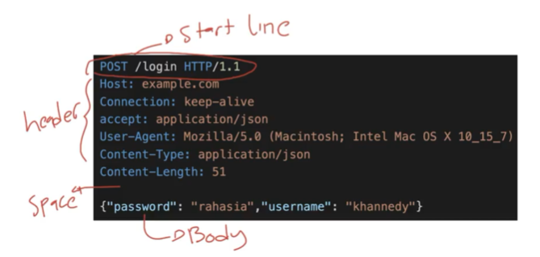
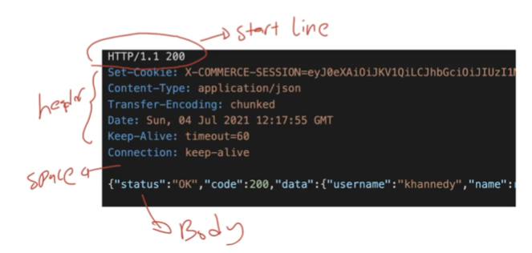
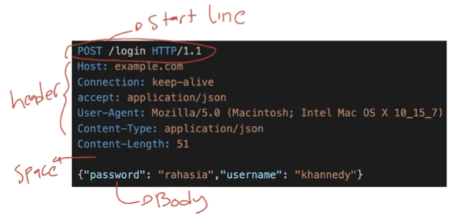
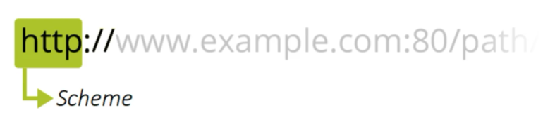
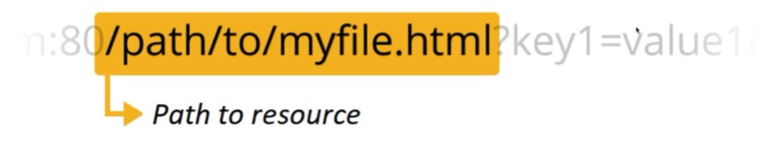
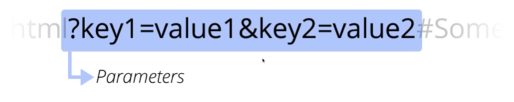
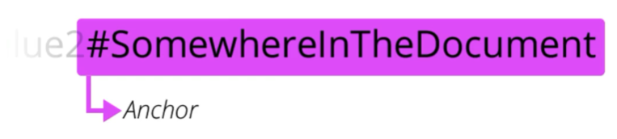

# HTTP

**Agenda**
* Pengenalan HTTP
* URL
* HTTP Method
* HTTP Header
* HTTP Body
* HTTP Response
* HTTP Cookie
* Dan lain-lain

## Pengenalan HTTP
* HTTP singkatan dari Hypertext Transfer Protocol
* merupakan protokol untuk melakukan transmisi hypermedia document, seperti HTML, javascript, CSS, Image, Audio, Video, dan lain-lain
* HTTP awalnya di desain untuk komunikasi antara Web Browser dan Web Server, namun saat ini sering juga digunakan untuk kebutuhan lain

### Client Server
* HTTP mengikuti arsitektur client dan server
* Client mengirimkan HTTP Request untuk meminta atau mengirim informasi ke server
* Dan server membalasnya dengan HTTP Response dari HTTP Request yang diterima

### Plain Language and Human Readable
HTTP didesain menggunakan bahasa yang mudah dimengerti oleh bahasa manusia, seperti:
* GET
* POST
* PUT
* DELETE
* HEAD
* OPTION

### Stateless
* HTTP merupakan protokol yang stateless
* Artinya tiap HTTP Request merupakan request yang independen, tidak ada keterkaitan atau hubungan dengan HTTP Request sebelum atau setelahnya
* Hal ini dilakukan agar HTTP Request tidak harus dilakukan dalam sequence, sehingga client bisa melakukan HTTP Request secara bebas tanpa ada aturan harus dimulai dari mana

### Session
* Jika HTTP merupakan protokol yang stateless, bagaimana dengan session? Misal client harus login terlebih dahulu sebelum berinteraksi?
* Untuk menangani permasalahan ini, HTTP memiliki fitur bernama HTTP Cookie
* HTTP Cookie memaksa client menyimpan informasi yang diberikan oleh server

## HTTP Version
* Spesifikasi HTTP selalu diperbaharui
* Saat ini, kebanyakan web berjalan di HTTP/1.1 atau HTTP2
* HTTP2 mulai hadir sekitar tahun 2015, dan saat ini sudah banyak diadopsi oleh semua Web di dunia

### HTTP/1.1 vs HTTP2
* Saat ini HTTP/1.1 merupakan fallback protocol, dimana Web Browser secara default akan melakukan request menggunakan HTTP/2, jika web server tidak mendukung, maka web browser akan melakukan fallback ke protocol HTTP/1.1
* Secara garis besar, spesifikasi HTTP/2 sama dengan HTTP/1.1, yang membedakan adalah pada HTTP/2, HTTP Request yang dikirim dalam bentuk teks, secara otomatis menjadi binary, sehingga lebih cepat dibandigkan HTTP/1.1
* Selain itu di HTTP/2, menggunakan algoritma kompresi untuk memperkecil request dan mendukung multiplexing, sehingga bisa mengirim beberapa request dalam satu connection yang sama
* Dari sisi pembuatan aplikasi, tidak ada perbedaan, semua ini biasanya sudah diurus secara otomatis oleh Web Server yang kita gunakan.

### HTTPS
* Secara default, HTTP tidaklah aman
* HTTPS merupakan HTTP dengan enkripsi
* Perbedaan HTTP dan HTTPS adalah: pada HTTPS menggunakan SSL (Secure Sockets Layer) untuk melakukan enkripsi HTTP Request dan HTTP Response
* Hasilnya HTTPS jauh lebih aman dibanding dengan HTTP biasa
* Web yang menggunakan HTTPS akan menggunakan https:// pada urlnya, dan yang hanya menggunakan HTTP tanpa enkripsi, akan menggunakan http://

## HTTP Terminology
* Saat kita belajar HTTP, ada banyak sekali menggunakan terminologi, istilah atau teknologi
* Kita perlu mengerti tentang hal tersebut

### Web Browser
* Merupakan aplikasi yang digunakan untuk mengakses Web menggunakan protokol HTTP
* Contohnya aplikasi Google Chrome, Firefox, Opera, Safari, dan lain-lain

### TCP
* TCP singkatan dari Transmission Control Protocol, adalah salah satu protokol dalam jaringan komputer yang biasa digunakan oleh web, email, FTP, atau lainnya
* Jika kita menggunakan jaringan internet, kemungkinan besar kita akan menggunakan protocol TCP untuk melakukan koneksi jaringannya

### IP
* IP singkatan dari Internet Protocol
* IP digunakan sebagai identitas komputer di jaringan
* Setiap komputer baik itu client dan server akan memiliki IP
* Untuk mengecek IP jaringan kita di internet, contohnya kita bisa mengakses web [IP Address](https://whatismyipaddress.com/)

### URL
* URL singkatan dari Uniform Resource Locator
* URL merupakan alamat dari sebuah resource di Web

### DNS
* singkatan dari Domain Name Server
* DNS merupakan tempat yang berisi data katalog pemetaan antara nama domain di URL menuju lokasi IP Computer
* Saat Web Browser mengakses sebuah domain di web, sebenarnya prosesnya akan bertanya ke DNS untuk mendapatkan IP, lalu Web Browser akan melakukan request ke IP tersebut
* Untuk mengecek IP sebuah domain, kita bisa gunakan [website berikut](https://www.whatismyip.com/dns-lookup/)

### Web Server
* Web Server merupakan aplikasi yang berjalan di jaringan internet yang bertugas sebagai server
* Web Server berisi informasi dan data yang bisa diakses oleh client
* Web Server akan menerima request dari client dan membalas request tersebut berupa informasi yang diminta oleh client

## HTTP Flow
* Bagaimana alur kerja HTTP?
* Dalam HTTP, biasanya terdapat 2 pihak yang terlibat, yaitu Client dan Server
* Client akan mengirimkan Request
* dan Server akan menerima Request dan membalas dengan Response

### Server
* Server merupakan sebuah komputer, dimana semua informasi disimpan pada komputer tersebut
* Komputer server biasanya menjalankan aplikasi Web Server agar bisa menerima protocol HTTP

### Client
* Client merupakan komputer yang bertugas mengirim HTTP Request ke komputer Server
* Untuk mengirim request HTTP, biasanya client akan menggunakan aplikasi Web Browser
* Client dan Server harus terkoneksi dalam jaringan yang sama agar bisa berkomunikasi
* Misal saja, client dan server terhubung dalam jaringan internet

### Request
* Client akan mengirim request ke Server dalam bentuk HTTP Request
* HTTP Request berisikan informasi seperti lokasi resource, data yang dikirim jika ada, dan lain-lain
* HTTP Request akan diterima oleh Server
* Selanjutnya Server akan memproses request yang diminta oleh Client tersebut

### Response
* Setelah Server memproses HTTP Request yang dikirim oleh Client
* Server akan membalas dengan HTTP Response
* HTTP Response biasanya berisikan data yang diminta oleh Client dalam HTTP Request

## Browser Network Tool
* Untuk lebih mempermudah melihat apa yang dilakukan di belakang Web Browser, biasanya Web Browser memiliki fitur Network Tool
* Contohnya di browser seperti Google Chrome dan Firefox sudah memiliki Network Tool
* Dengan Network Tool, kita bisa melihat semua detail HTTP Request dan HTTP Response yang dilakukan oleh Client dan Server

### Tugas
* Buka website [berikut](https://www.programmerzamannow.com/)
* Lalu lihat informasi HTTP Request dan HTTP Response yang terjadi menggunakan Network Tool yang terdapat di Browser yang kita gunakan 

## HTTP Request dan Response

### HTTP Message
* HTTP Request dan HTTP Response sebenarnya adalah sebuah HTTP Message
* HTTP Message memiliki standarisasi format
* Dengan demikian, jika kita ingin membuat Client dan Server sendiri, sebenarnya bisa kita lakukan, asal kita mengikuti standarisasi format HTTP Message
 

###  
 

* bentuknya teks 
* header isinya key dan value, contohnya: host itu isinya adalah domain
* /login merupakan context path
* URL itu gabungan antara host dengan context path
* space berguna untuk memisahkan antara Header dengan Body
* Body bisa berupa teks / video / gambar / audio

### 
 

* kalau pada response langsung HTTP version dan status code pada start line
* Setelah start line diresponse barulah header
* Body bisa berupa teks / video / gambar / audio

## HTTP Method
* Dalam HTTP Request, hal yang pertama kita perlu tentukan adalah HTTP Method
* HTTP Method mirip seperti kategori request
* Ada banyak HTTP Method yang dapat kita gunakan ketika membuat HTTP Request, dan kita bisa sesuaikan dengan kebutuhan yang kita inginkan

### 
 

* Kata pertama pada baris pertama (start line) seperti: `POST` itu adalah contoh HTTP Method

### Jenis HTTP Method

| HTTP Method                       | Keterangan                                                |
| --------------------------------- | --------------------------------------------------------- |
| GET                               | GET method digunakan untuk melakukan request data. REquest menggunakan GET hanya untuk menerima data, bukan untuk mengirim data                               |
| HEAD                              | HEAD method digunakan sama seperti dengan GET, tapi tanpa membutuhkan response body (misal untuk melihat apakah ada data gambar atau tidak -> butuh request data tapi tidak butuh datanya)                              |
| POST                              | POST method digunakan untuk mengirim data ke Server, biasanya POST digunakan untuk mengirim data baru sehingga biasanya memiliki request body                               |
| PUT                               | PUT method digunakan untuk mengganti semua data yang terdapat di Server dengan data baru yang dikirim di Request (misal udah upload 1 gambar, tapi ingin ganti gambarnya (ditimpa), biasanya menggunakan PUT)                       |
| DELETE                            | DELETE method digunakan untuk menghapus data                              |
| PATCH                             | PATCH method digunakan untuk mengubah sebagian data  (PUT itu mengubah seluruh data, kalau PATCH hanya mengganti sebagian). Misalnya di web sudah punya nama depan, nama tengah, dan nama belakang. Kalau pada PUT maka akan menimpa semuanya, kalau PATCH hanya mengubah salah satu saja, contohnya: mengubah nama depan saja atau nama tengahnya saja                         |
| OPTIONS                           | OPTIONS method digunakan untuk mendeskripsikan opsi komunikasi yang tersedia. Biasanya melakukan HTTP Method OPTIONS untuk bertanya ke server kira-kira ada opsi atau operasi komunikasi apa saja yang tersedia di server tersebut, apakah ada POST, GET, DELETE, dsb                         |
| TRACE                             | TRACE method merupakan request method untuk debugging. Response TRACE method akan mengembalikan seluruh informasi yang dikirim oleh Client. Saat membuat web, sangat direkomentasikan untuk **tidak mengaktifkan TRACE method** ketika sudah live di production karena bisa disalahgunakan oleh orang lain.                              |

## URL
* URL singkatan dari Uniform Resource Locator
* URL merupakan alamat dari sebuah resource di Web
* URL wajib kita gunakan untuk menuju informasi resource yang akan kita tuju dalam Web
* Tanpa URL, Client atau Server tidak akan mengerti informasi apa yang ingin kita cari

### Anatomi URL
* URL terdiri dari beberapa bagian
* Beberapa bagian wajib ada, beberapa bagian tidak wajib ada
* Berikut adalah contoh URL:
    * https://www.programmerzamannow.com/
    * https://www.programmerzamannow.com/premium-membership/
    * https://www.programmerzamannow.com/?search=java

### Schema
* Bagian awal di URL adalah schema yang mengindikasikan protocol yang perlu digunakan oleh Client
* Biasanya dalam URL website, schema protocol tersebut adalah http dan https

### Authority
* Selanjutnya, dipisahkan dengan tanda :// diikuti dengan authority, yang terdiri dari nama domain dan nomor port yang dipisah menggunakan titik dua
* Biasanya dikenal dengan domain. Namun kenapa tidak disebut domain? karena dalam authority sebenarnya terdapat 2 bagian.
* Nama domain nanti akan ditanyakan ke DNS untuk mendapatkan alamat IP nya
* Namun kita juga bisa langsung menggunakan IP jika memang website tersebut tidak memiliki nama domain
* Nomor port tidak wajib, tanpa nomor port, secara default bernilai 80 untuk http dan 443 untuk https

### Path
* Ada beberapa yang bilang bahwa ini adalah Context Path. (sama saja)
* Path merupakan komponen yang tidak wajib
* Path biasanya berisikan informasi menuju ke detail resource yang kita tuju
* Path terlihat seperti kumpulan folder dan diakhiri dengan file yang ingin kita akses

### Parameters
* Dalam URL juga bisa terdapat informasi parameters, namun ini tidak wajib
* Parameter dipisah oleh karakter `?` setelah Authority atau Path
* Parameter merupakan informasi tambahan yang berisi key=value, jika ingin menambahkan lebih dari satu parameter, kita bisa tambahkan dengan menggunakan karakter `&`

### Anchor
* Achor merupakan bagian yang tidak wajib di URL
* Anchor merupakan representasi bookmark dalam sebuah halaman website
* Misal jika dalam website terdapat banyak sekali bagian informasi, kita bisa menggunakan anchor sebagai bookmark ke tiap bagian informasi tersebut agar lebih mudah diakses.

