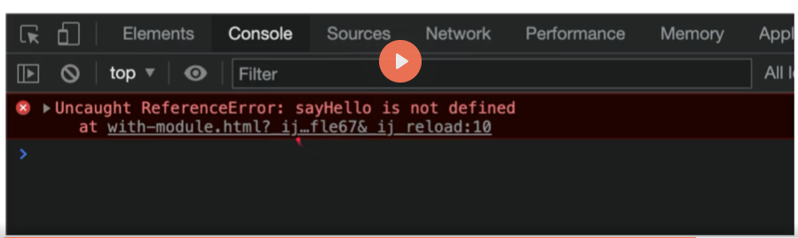
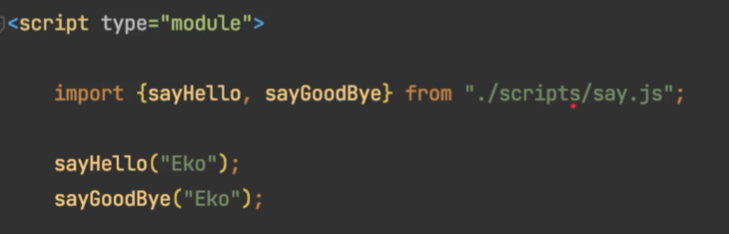

# Javascript Module

## Pendahuluan
### Sebelum Belajar
* HTTP
* Javascript Dasar
* Javascript Object Oriented Programming
* Javascript Standard Library

### Agenda
* Pengenalan Javascript Module
* Live Server
* Tanpa Module vs Dengan Module
* Export dan Import
* Alias
* Export Default
* Module Object
* Dan lain-lain

## Pengenalan Javascript Modules

### Latar Belakang
* Dahulu kode program Javascript biasanya dimulai dari kode yang kecil dan sedikit di setiap halaman, jadi jarang sekali kita aka menggunakan kode Javascript dengan ukuran besar dalam satu halaman web
* Namun saat ini, kebutuhan web sudah berbeda, semenjak makin populernya framework-framework Javascript untuk membuat Frontend, kebutuhan pembuatan kode Javascript semakin kompleks dan besar
* Oleh karena itu, sudah seharusnya saat ini, saat membuat kode Javascript, kita perlu melakukan mekanisme memotong-motong kode Javascript, sehingga tidak terlalu kompleks dan banyak dalam satu file Javascript

### Javascript Modules
* Javascript Modules merupakan fitur dimana kita bisa membuat module (kode Javascript yang bisa digunakan ulang) untuk kode Javascript lain
* Javascript Modules diawali pada teknologi bernama NodeJS, selanjutnya banyak library yang mengadopsi penggunaan Javascript Modules di NodeJS agar bisa berjalan di Web Browser, seperti: library CommonJS, AMD, RequireJS, dan lain-lain
* Namun untungnya, saat ini Browser modern sudah banyak mendukung Javascript Modules, kecuali jika masih menggunakan Internet Explorer

### Import dan Export
* Secara garis besar, ada dua kata kunci yang digunakan dalam Javascript Modules, yaitu import dan export
* import merupakan kata kunci yang digunakan untuk mengambil sesuatu dari module lain
* Sedangkan export merupakan kata kunci yang digunakan untuk memberitahu module lain, bagian mana yang ingin kita ekspose keluar, sehingga bisa di-import oleh module lain

## Live Server
* Saat kita menggunakan fitur Javascript Module, sangat disarankan untuk menjalankan kode Javascript kita dalam Web Server
* Hal ini karena spesifikasi dari Javascript module meminta secara default kode Javascript perlu di satu domain server yang sama, jika kita membuat file html menggunakan URL file ://, maka dikhawatirkan akan terjadi error CORS (Cross Origin Resource Sharing)

### Visual Studio Code
* Jika menggunakan Visual Studio Code, disarankan untuk menginstall plugin [Live Server](https://marketplace.visualstudio.com/items?itemName=ritwickdey.LiveServer)
* Plugin Live Server ini bisa digunakan untuk menjalankan local web server, sehingga kita bisa mengakses kode web Javascript kita menggunakan domain localhost

### JetBrains IDE
* Jika menggunakan JetBrains IDE, sudah terdapat fitur untuk membuka halaman web dalam local web server
* Tidak perlu menginstall plugin tambahan

## Tanpa Module
* Sebelum kita membahas Javascript Module, sekarang kita akan coba dulu tanpa menggunakan module
* Saat kita membuat file Javascript, lalu kita load file Javascript tersebut di web, secara default semua kode Javascript di file tersebut bisa diakses, baik itu variable, function atau class

### Dengan Module
* Namun jika kita menggunakan module, kita bisa secara selektif memilih bagian kode mana yang ingin kita ekspos keluar
* Secara default kode yang kita buat menggunakan Javascript Module tidak bisa digunakan dari luar file, kecuali kita memintanya untuk mengekspos keluar

## Membuat Module
* Membuat module sangat sederhana, kita cukup membuat file Javascript saja
* Yang membedakan adalah, saat kita akan meload file Javascript dari HTML, kita tidak menggunakan type javascript lagi, melainkan menggunakan type module

## File .js dan .mjs
* Karena file javascript Module sebenarnya sama dengan Javascript, kadang developer membedakan nama file untuk Javascript Module menggunakan .mjs
* Hal ini sebenarnya tidak ada kewajiban, hanya saja agar mempermudah ketika tahapan development, kita bisa dengan mudah membedakan mana file Javascript biasa, mana file Javascript module hanya dengan extension file nya saja
* Pada kelas ini, kita akan tetap menggunakan file .js ketika membuat module, agar tidak membingungkan untuk pemula

### Hasil Javascript Module

### Kenapa Error?
* Secara default, saat kita menggunakan fitur Javascript Module, semua kode (function, variable, class, dan lain-lain) tidak akan diekspos keluar module tersebut
* Jika kita ingin mengekspos kode tersebut, kita harus memberitahunya secara eksplisit

## Export
* export merupakan kata kunci yang digunakan untuk mengekspos kode dari sebuah module
* export bisa ditambahkan diawal sebuah variable, function, atau class

## Import
* Export digunakan untuk mengekspos kode di module, jika kita ingin menggunakan kode yang sudah diekspos di module, kita bisa menggunakan kata kunci import
* Cara menggunakan kata kunci import adalah sebagai berikut: `import {namaFunction, namaVariable, NamaClass from "lokasi-module.js"}`
* Module hanya bisa digunakan di module lain, jadi pastikan ketika membuat script, kita harus menggunakan type module
* Saat menggunakan import, kita tidak perlu lagi menambahkan script module src satu per satu, karena sudah di handle oleh Browser secara otomatis ketika menggunakan module

## Variable di Module
* Salah satu hal yang membingungkan pada variabel di Javascript adalah ketika kita membuat variabel di global scope, maka variabel tersebut bisa diubah nilainya oleh file Javascript lain
* Saat kita menggunakan module, ketika kita buat variabel, maka variabel tersebut hanya berada pada module tersebut, tidak bisa digunakan di module lain

### Export Variable di Module
* Jika kita ingin mengekspos variable ke luar module, kita juga bisa menggunakan kata kunci export di awal deklarasi variablenya

## Class di Module
* Selain function dan juga variable, di module juga kita bisa menambahkan class
* Secara default, class tersebut hanya bisa diakses dari dalam modulenya saja, tidak bisa diluar module
* Jika kita ingin mengekspos class yang kita buat, kita juga bisa menggunakan kata kunci `export` di awal deklarasi classnya

## Export Multiple
* Sebelumnya kita selalu menggunakan kata kunci export diawal variable, function, atau class
* Sebenarnya kita bisa menggunakan export sekaligus beberapa data, caranya cukup gunakan perintah `export {variable, function, class, danLainLain}`

## Alias
* Saat kita membuat aplikasi Javascript, semakin lama kemungkinan module akan semakin banyak
* Dan bisa saja akan ada nama variable atau nama function atau nama class yang sama antar module
* Hal ini akan menyulitkan ketika ada module yang menggunakan beberapa module secara bersamaan, namun ternyata variable, function atau classnya memiliki nama yang sama
* Untungnya, module memiliki fitur alias, dimana kita bisa mengubah nama variable, function. atau classnya

### Alias di Export (Tidak direkomendasikan)
* Kita dapat menggunakan alias ketika melakukan export di module
* Caranya menggunakan kata kunci as, lalu diikuti dengan nama alias: `export {variable as variableLain, function as functionLain, Class as ClassLain}`

### Alias di Import (Recommended)
* Atau rekomendasinya sebenarnya melakukan alias ketika melakukan import
* Sehingga ketika export, nama tidak perlu berubah
* Untuk melakukan alias ketika import, kita bisa gunakan kata kunci `as`, diikuti dengan nama alias: `import {function as functionLain} from "./module.js"`

## Export Default
* Sampai saat ini, kita selalu melakukan export dengan nama, baik itu nama variable, function, dan yang lainnya
* Ada juga fitur yang bernama export default, ini adalah fitur yang digunakan untuk mempermudah untuk membuat default data di module, dan membantu Javascript agar kompatibel dengan CommonJS dan AMD module system

### Cara Export Default
* `export default namaFunction;`
* `export default function(){...}`
* `export default namaVariable;`
* `export default namaVariable = value;`
* `export default NamaClass;`
* `export default class {...}`

### Cara Import Default
* `import aliasFunction from "./module-default.js"`
* `import {default as aliasFunction} from "./module-default.js"`
* `import aliasVariable from "./module-default.js"`
* `import {default as aliasVariable} from "./module-default.js"`
* `import AliasClass from "./module-default.js"`
* `import {default as AliasClass} from "./module-default.js"`

### Default dan Named Export 
* Dalam satu module, kita bisa menggabungkan export default dan export named
* Yang tidak boleh adalah, dalam satu module membuat lebih dari satu default
* Cara import default dan named secara bersamaan bisa menggunakan perintah:
    *  `import defaultAlias, {named1, named2} from "./module.js";`
    *  `import {default as defaultAlias, named1, named2} from "./module.js";`

### Rekomendasi
* Bedakan antara default dan named, karena jika digabungkan kadang akan membingungkan ketika melakukan import
* Sebisa mungkin selalu gunakan export named dibandingkan export default

## Module Object
* Ketika sebuah module berisikan banyak sekali export data, maka melakukan import satu persatu akan terlihat berantakan
* Rekomendasinya ketika kita ingin mengimport module yang sangat banyak export datanya, gunakan Module Object
* Module Object sederhananya adalah object Javascript yang berisi attribute hasil yang diexport pada module
* Cara membuat module object bisa kita lakukan misal seperti ini: `import * as NamaModule from "./module.js"`
* Selanjutnya kita bisa gunakan NamaModule sebagai object untuk module tersebut

## Aggregating Modules
* Aggregate = menyatukan beberapa module
* Ada waktunya kadang kita ingin meng-agregate beberapa module menjadi satu agar penggunaannya lebih sederhana
* Jika module sudah banyak, maka ketika butuh banyak kode dari banyak module, kita harus sebutkan nama module tersebut tiap kalau import 
* Dengan melakukan aggregate, kita bisa membuat module aggregate, yang isinya menggabungkan export dari module lain
* Caranya sangat mudah, cukup gunakan perintah: `export {a,b,c} from "./module.js"`

## Dynamic Module Loading
* Saat kita menggunakan module dengan cara import, maka semua module akan di load
* Pada kenyataannya, kadang kita tidak ingin meload semua module diawal, kita ingin meload module ketika dibutuhkan saja, ini akan menghemat bandwith jaringan juga, karena kita tidak perlu download semua module diawal
* Javascript mendukung dynamic module loading, caranya kita bisa menggunakan `function import()`, dimana hasilnya berupa `Promise<ModuleObject>` (Promise adalah materi yang kompleks, ini akan dibahas di kelas Javascript Async)

## Materi Selanjutnya
* Javascript Document Object Model
* Javascript Async
* Javascript Decorator