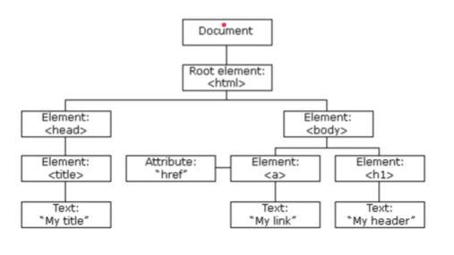

# Javascript DOM

## Pendahuluan
### Sebelum Belajar
* Javascript Dasar
* Javascript Object Oriented Programming
* Javascript Standard Library
* Javascript Modules

### Agenda
* Pengenalan Document Object Model
* Document
* Node
* Element
* Attr
* Event
* Event Handler
* Dan lain-lain

## Pengenalan DOM
* Ketika sebuah website di load oleh Browser, maka Browser akan membuat Document Object Model untuk halaman website tersebut
* DOM dibuat dalam bentuk tree / pohon yang tiap cabangnya berisikan object dari jenis elemen HTML
* Javascript memiliki kemampuan untuk memanipulasi DOM, artinya dengan Javascript, kita bisa mengakses tiap object di DOM bahkan memanipulasi objectnya

### Diagram DOM

### DOM dan Javascript
* DOM bukanlah fitur atau bahasa pemrograman, DOM sebenarnya hanyalah representasi Object dari Struktur halaman web
* DOM sendiri sebenarnya bukanlah bagian dari bahasa pemrograman Javascript, melainkan bagian dari Web API
* DOM sendiri di desain secara agnostik artinya sebenarnya bisa digunakan menggunakan bahasa pemrograman apapun, karena memang untuk Web, kita tidak hanya bisa menggunakan bahasa pemrograman Javascript

## Tipe Data
* DOM memiliki representasi data
* Tidak terlalu banyak tipe data yang terdapat di DOM
* Oleh karena itu, sebenarnya DOM sangat sederhana, namun penggunaannya sangat bermanfaat
 

| Tipe Data                  | Keterangan                                                |
| -------------------------- | --------------------------------------------------------- |
| Document                   | Merupakan representasi dari halaman web                   |
| Node                       | Merupakan base class untuk semua tipe data di DOM, seperti Document, Element, dan Attr           |
| Element                    | Merupakan representasi object element di halaman web, misal: head, body, form, input, dan lain-lain           |
| NodeList                   | Merupakan array/collection yang berisikan Node            |
| Attr                       | Atau attribute, merupakan representasi object attribute dalam element           |
| NamedNodeMap               | Merupakan collection yang berisikan Attr dalam bentuk Map          |

## Document
* Document merupakan representasi object dari halaman web
* Dalam satu halaman web, terdapat satu document, dan kita tidak perlu membuatnya secara manual, karena otomatis akan ada di browser
* Untuk mengakses Document, kita bisa gunakan object document
* [Dokumentasi](https://developer.mozilla.org/en-US/docs/Web/API/Document)

### document Object
* Document secara otomatis dibuat dalam browser ketika membuka halaman web, sehingga kita tidak perlu membuka objek Document secara manual
* Kita bisa langsung menggunakan kata kunci `document`

### Document Property
* Document memiliki banyak sekali property
* Property dalam Document bisa kita gunakan untuk melihat semua data yang terdapat dalam document halaman web
* [Dokumentasi](https://developer.mozilla.org/en-US/docs/Web/API/Document#instance_properties)

### Document Method
* Document memiliki banyak sekali method
* Banyak method yang terdapat di document digunakan untuk memanipulasi data DOM, misal membuat Node, Element, Attribute atau mengambil dan menyeleksi Node di dalam document
* [Dokumentasi](https://developer.mozilla.org/en-US/docs/Web/API/Document#instance_methods)

## Node
* Node adalah base class dari Document, Element, dan Attr
* Artinya semua fitur yang dimiliki di Node dimiliki diturunannya
* Node dalam DOM itu bentuknya adalah Tree (pohon), artinya dengan Node, kita bisa melihat Parent (node diatasnya), Children (node dibawahnya), Sibling (node disebelahnya)
* [Dokumentasi](https://developer.mozilla.org/en-US/docs/Web/API/Node)

### Node Property
* Node memiliki banyak sekali property
* Property di Node banyak sekali informasi reference ke Node lainnya, seperti ke node parent nya, node children nya, atau node sebelahnya
* [Dokumentasi](https://developer.mozilla.org/en-US/docs/Web/API/Node#instance_properties)

### Node Methods
* Node memiliki banyak sekali method
* Method di Node bisa digunakan untuk memanipulasi data Node di dalam Node tersebut, misal menambah / menghapus Node children
* [Dokumentasi](https://developer.mozilla.org/en-US/docs/Web/API/Node#instance_methods)

## Element
* Element merupakan Node yang berbentuk element, biasanya adalah element HTML, misalnya `<html>`, `<head>`,`<body>`,`
`,`<table>`, dan lain-lain
* [Dokumentasi](https://developer.mozilla.org/en-US/docs/Web/API/Element)

### Element Property
* Element memiliki banyak sekali property
* Dan karena Element adalah turunan dari Node, semua property Node pun bisa digunakan di Element
* [Dokumentasi](https://developer.mozilla.org/en-US/docs/Web/API/Element#instance_properties)

### Element Method
* Element memiliki banyak sekali method
* Dan karena Element adalah turunan dari Node, semua method Node pun bisa digunakan di Element
* [Dokumentasi](https://developer.mozilla.org/en-US/docs/Web/API/Element#instance_methods)

### Membuat Element
* Sebelumnya kita hanya mengambil element menggunakan id, artinya kita perlu buat dulu element nya di HTML
* Kita juga bisa membuat object element baru dan menambahkannya ke halaman web
* Kita bisa menggunakan method `createElement(tag)` pada Document
* [Dokumentasi](https://developer.mozilla.org/en-US/docs/Web/API/Document/createElement)

## NodeList
* NodeList adalah kumpulan dari Node
* Biasanya NodeList digunakan ketika kita menyeleksi banyak Node sekaligus, misal kita ingin mengambil semua children di Node misalnya
* [Dokumentasi](https://developer.mozilla.org/en-US/docs/Web/API/NodeList)

### Live vs Static Node List
* NodeList memiliki 2 tipe yaitu Live dan Static
* Live artinya perubahan yang terjadi pada NodeList nya akan merubah semua NodeList yang sama
* Static artinya perubahan yang terjadi pada NodeList nya, tidak akan merubah semua NodeList yang sama
* Saat kita menggunakan `element.childNodes`, NodeList tersebut bersifat Live
* Saat kita menggunakan `document.querySelectorAll()`, NodeList tersebut bersifat Static.

Jika ingin manipulasi data, langsung manipulasi ke element-nya.

## Attr
* Attr atau attribute merupakan representasi dari attribute sebuah element, atau singkatnya: key-value, key nya adalah nama attribute dan value nya adalah value attribute
* [Dokumentasi](https://developer.mozilla.org/en-US/docs/Web/API/Attr)

### Attr Value
* Kadang kebanyakan programmer ingin langsung mendapatkan value Attr
* Jarang sekali menggunakan object Attrnya
* Untuk mendapatkan value secara langsung, kita bisa menggunakan method `getAttribute(name)` di Element

### Membuat Attr
* Untuk membuat Attr, kita bisa menggunakan `document.createAttribute(name)`
* Lalu untuk menambahkannya ke Element, kita bisa gunakan `element.setAttributeNode(attr)`
* Atau kita juga bisa langsung membuat Attr langsung dengan name dan value nya menggunakan `element.setAttribute(name, value)`

Attribute juga dianggap sebagai Node di DOM

## NamedNodeMap
* NamedNodeMap merupakan kumpulan dari Attr
* Mirip seperti list, namun isinya adalah Attr
* [Dokumentasi](https://developer.mozilla.org/en-US/docs/Web/API/NamedNodeMap)

ini turunan dari iterator jadi bisa kita lakukan iterasi juga.

## Text Node
* Saat kita membuat HTML, kadang kita membuat teks tanpa tag
* Saat halaman web tersebut direpresentasikan di dalam DOM, text tanpa tag bukanlah merupakan Element, melainkan Node
* Lebih tepatnya adalah Text Node
* [Dokumentasi](https://developer.mozilla.org/en-US/docs/Web/API/Text)

Sebenarnya tidak direkomendasikan membuat text node, karena agak sulit datanya diambil karena tidak memiliki sebuah id sehingga bila ingin mengambil data perlu menggunakan iterasi. 

### Membuat Text Node
* Kita juga bisa membuat Text Node menggunakan method `document.createTextNode(string)`
* Hasilnya berupa Text yang bisa kita tambahkan ke Node lain

## Event Handler
* Node memiliki kemampuan bereaksi terhadap suatu kejadian, misal: kejadian di klik, mouse di atas node tersebut, dan lain-lain
* Ada banyak sekali jenis kejadian yang bisa kita buatkan aksinya ketika kejadian tersebut terjadi, atau dikenal dengan nama **Event Handler**
* Ada dua cara kita menambahkan Event Handler ke Node, menggunakan Event Target atau Global Event Handler
* [Dokumentasi Event Target](https://developer.mozilla.org/en-US/docs/Web/API/EventTarget)
* [Dokumentasi Global Event Handlers](https://developer.mozilla.org/en-US/docs/Web/Events/Event_handlers)

### Event Target
* Event Target merupakan parent class dari Node, artinya semua Node memiliki kemampuan dari Event Target
* Pada Event Target, kita bisa menggunakan method `addEventListener(type, callback)` untuk menambahkan Event Handler

### Global Event Handler
* Selain menggunakan Event Target, untuk menambahkan Event Handler, kita juga bisa menggunakan Global Event Handler
* Global Event Handler bukanlah sebuah super class, hanya kontrak yang bisa kita gunakan untuk menambah event handler sesuai dengan type event nya.

Bila menggunakan EventTarget dapat melakukan beberapa kali callback, sedangkan bila menggunakan Global Event Handler cuman bisa sekali saja.

## Event

### Jenis Event
* DOM sendiri memiliki banyak sekali jenis event, tidak hanya click
* Jenis event yang bisa kita gunakan biasanya disesuaikan dengan target event nya, misal pada element video, ada event play, pause, sedangkan pada element button, tidak ada event play atau pause
* Untuk lebih detailnya, ada apa saja jenis event nya, kita bisa lihat pada [Dokumentasi berikut](https://developer.mozilla.org/en-US/docs/Web/Events)

### Event
* Saat kita membuat callback function untuk Event Handler, kita juga bisa menerima data event yang memicu event terjadi
* Data Event tersebut bisa berbeda-beda, tergantung jenis event nya, contohnya untuk Click, data event nya berupa Mouse Event (yang berisi lokasi mouse dan lain-lain)
* Kita bisa lihat detail dari data tiap event di [halaman dokumentasi](https://developer.mozilla.org/en-US/docs/Web/API/Event)

## Style
* DOM juga bisa digunakan untuk memanipulasi attribute style pada element yang lebih mudah
* Kita tidak perlu menggunakan `setAttribute("style","value")` setiap ingin mengubah style sebuah element
* Kita bisa langsung gunakan `element.style.name = value`
* [Dokumentasi](https://developer.mozilla.org/en-US/docs/Web/API/HTMLElement/Style)

### Nama Style
* Saat kita mengubah sebuah style, penamaan style menjadi berubah
* Pada style css, rata-rata menggunakan format lowercase dan -, misal `background-color`
* Sedangkan pada DOM Style, menggunakan format pascalCase, misal: `backgroundColor`

## InnerText dan InnerHTML

### Text Content dan Inner Text
* Selain textContent, terdapat property lain bernama innerText untuk mendapatkan isi text sebuah element
* Tujuannya sama, untuk mengambil atau mengubah isi text konten sebuah element, anmun ada perbedaannya
* textContent akan mengembalikan semua isi dari konten text sebuah element
* innerText bisa tahu bagian mana yang ditampilkan, dan dia hanya akan mengambil text yang ditampilkan saja

### innerHTML
* Jika TextContent dan Inner Text hanya mengambil text saja, Inner HTML akan mengambil seluruh element HTML nya sebagai text
* Ini juga cocok jika kita ingin mengubah isi dari element menggunakan text yang berisi tag HTML

### Mengubah Element dengan Inner HTML
* Salah satu kemampuan dari innerHTML adalah kita bisa mengubah isi dari children sebuah element hanya dengan string
* Tag yang terdapat di dalam String secara otomatis akan menjadi child element

## Window
* Window merupakan representasi window yang berisikan DOM Document
* Beberapa Javascript function sebenarnya berasal dari object Window, seperti: `alert()`, `confirm()`, dan `prompt()`
* Ada banyak sekali property, method, dan event yang bisa kita gunakan pada window
* Untuk menggunakan Window, kita tidak perlu membuat objectnya, cukup gunakan kata kunci window
* [Dokumentasi](https://developer.mozilla.org/en-US/docs/Web/API/Window)

## Query Selector
* Sebelumnya kita sudah menggunakan method `querySelectorAll()` pada Document, sekarang kita akan bahas lebih lengkap tentang Query Selector
* Query Selector merupakan method untuk menseleksi node sesuai dengan pola yang kita ingin cari
* Terdapat dua method untuk Query Selector:
    * `Document.querySelector(pola)` digunakan menyeleksi node pertama yang sesuai dengan pola
    * `Document.querySelectorAll(pola)` digunakan untuk menyeleksi semua node yang sesuai dengan pola

### Pola Query Selector
* Pola untuk Query Selector adalah menggunakan CSS Selector
* Penggunaan Pola nya mirip ketika kita membuat Selector di CSS
* Jika belum tahu tentang CSS Selector, disarankan untuk dipelajari ulang tentang materi CSS
* [Dokumentasi](https://developer.mozilla.org/en-US/docs/Web/CSS/CSS_Selectors)

### Universal Selector
* Universal Selector merupakan selector untuk menyeleksi semua element
* Kita bisa menggunakan karakter `*`
* [Dokumentasi](https://developer.mozilla.org/en-US/docs/Web/CSS/Universal_selectors)

### Type Selector
* Type Selector adalah selector yang digunakan untuk menyeleksi tag type HTML yang kita pilih
* Untuk menggunakannya, kita bisa langsung sebutkan nama tag nya
* [Dokumentasi](https://developer.mozilla.org/en-US/docs/Web/CSS/Type_selectors)

### Class Selector
* Class Selector merupakan selector untuk menyeleksi semua element yang memiliki class yang sesuai selector
* Untuk menggunakannya, kita bisa sebutkan nama class nya diawali dengan titik
* [Dokumentasi](https://developer.mozilla.org/en-US/docs/Web/CSS/Class_selectors)

### ID Selector
* ID Selector merupakan selector yang digunakan untuk menyeleksi id yang sesuai selector
* Untuk menggunakannya, kita bisa gunakan nama id diawali dengan karakter `#`
* [Dokumentasi](https://developer.mozilla.org/en-US/docs/Web/CSS/ID_selectors)

### Attribute Selector
* Attribute Selector merupakan selector yang bisa digunakan untuk menyeleksi element berdasarkan attribute nya
* Kita bisa menggunakan selector `[attribute]`
* Atau bisa juga untuk tag tertentu, misal menggunakan selector `div[attribute]`
* [Dokumentasi](https://developer.mozilla.org/en-US/docs/Web/CSS/Attribute_selectors)

### Operator di Attribute Selector
* Kita juga bisa menggunakan operator pada attribute selector
* Misal `[attribute=value], [attribute^=value]` dan lain-lain
* [Dokumentasi](https://developer.mozilla.org/en-US/docs/Web/CSS/Attribute_selectors#syntax)

### Dan Selector Lainnya
* [Dokumentasi](https://developer.mozilla.org/en-US/docs/Web/CSS/CSS_Selectors)

## Node Type
* Saat kita menyeleksi Node menjadi NodeList, kadang kita ingin tahu tipe Node tersebut
* Apakah Element, TextElement atau yang lainnya
* Node sendiri memiliki property bernama nodeType, dimana kita bisa melihat tipe dari node tersebut
* [Dokumentasi](https://developer.mozilla.org/en-US/docs/Web/API/Node/NodeType)

## HTML Element
* Element merupakan representasi dalam DOM
* Namun, saat menggunakan HTML, implementasi detailnya sebenarnya adalah HTML Element, yaitu turunan dari Element
* HTML Element memiliki banyak sekali property dan method tambahan selain dari Element DOM
* Kebanyakan HTML Element memiliki property yang sesuai dengan attribute yang ada pada tag html tersebut, oleh karena itu, kadang kita tidak butuh lagi menggunakan method `setAttribute` dan `getAttribute`
* [Dokumentasi](https://developer.

## HTML Form Element
* Form adalah salah satu element yang memiliki banyak sekali fitur diluar dari Element DOM
* Hal ini karena penggunaan Form memang lebih kompleks dibandingkan element HTML lainnya
* Ada banyak sekali property, method, dan juga event yang terdapat pada HTML form element atau input element
* [Dokumentasi Form Element](https://developer.mozilla.org/en-US/docs/Web/API/HTMLFormElement)
* [Dokumentasi Input Element](https://developer.mozilla.org/en-US/docs/Web/API/HTMLInputElement)

### Akses Form via Name
* Salah satu kelebihan Form adalah kita bisa mengakses form hanya dengan menggunakan form name
* Kita bisa gunakan `document.forms[name]`
* Atau jika kita ingin mengakses inputnya, kita juga bisa menggunakan name nya `document.forms[name][inputName]`

## HTML Table Element
* Salah satu HTML Element yang kompleks selain Form adalah Table
* HTML Table Element juga memiliki banyak sekali property, method, dan event yang khusus
* [Dokumentasi](https://developer.mozilla.org/en-US/docs/Web/API/HTMLTableElement)

## HTML Element Lainnya
* Sebenarnya masih banyak element-element HTML lainnya yang terdapat dalam Standard Web API
* Namun akan terlalu banyak jika dibahas satu per satu
* Oleh karena itu disarankan untuk explore HTML element yang memang ingin dipelajari di halaman documentation resminya
* [Dokumentasi](https://developer.mozilla.org/en-US/docs/Web/API#interfaces)

## Materi Selanjutnya
* Javascript Async
* Javascript Decorator
* Javascript Web API