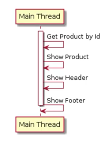
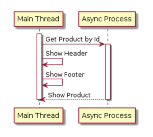
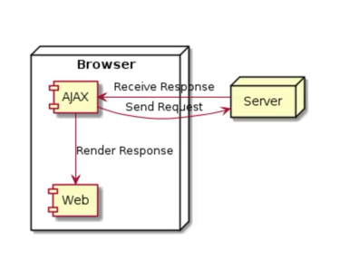
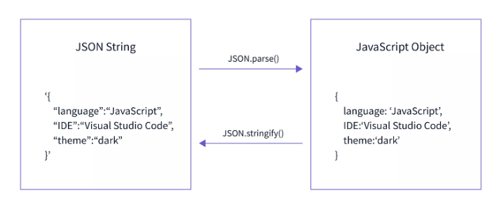
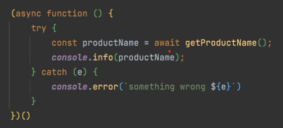
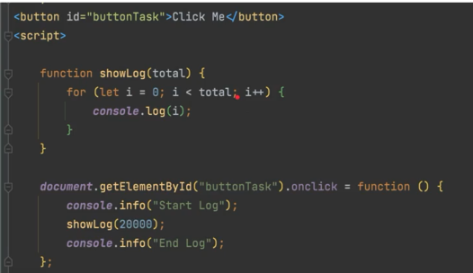
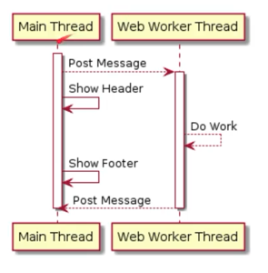
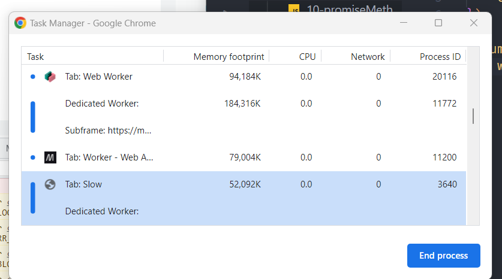

# Javascript Async

## Sebelum Belajar
* Javascript Dasar
* Javascript Object Oriented Programming
* Javascript Modules
* Javascript Document Object Model
* Belajar HTTP


## Agenda 
* Pengenalan Asynchronous
* Callback
* AJAX
* Promise
* Fetch API
* Async Await
* Web Worker


## Pengenalan Asynchronous

### Apa itu Synchronous?
* Program dalam Javascript secara default akan dieksekusi baris per baris
* Secara default, proses di Javascript akan dieksekusi secara Synchronous, artinya baris selanjutnya akan dieksekusi setelah baris sebelumnya selesai dikerjakan
* Proses Synchronous juga biasa disebut Blocking, karena harus menunggu tiap proses selesai, barus proses selanjutnya bisa dilakukan



### Apa itu Asynchronous?
* Walaupun secara default proses di Javascript dieksekusi secara Synchronous, namun kita bisa membuatnya menjadi Asynchronous
* Berbeda dengan Synchronous, pada proses Asynchronous, Javascript tidak akan menunggu proses tersebut selesai, melainkan Javascript akan melanjutkan baris selanjutnya, tanpa harus menunggu proses Asynchronous selesai
* Proses Asynchronous juga biasa disebut **Non-Blocking**




## Callback

### Apa itu Callback?
* Callback, merupakan mekanisme untuk memanggil kembali kode yang ada di program dari proses Async
* Callback biasanya dibuat dalam bentuk function as parameter, dan parameter function tersebut akan dieksekusi setelah proses Async selesai
* Dengan menggunakan Callback, program bisa menerima informasi yang dibutuhkan dari proses yang berjalan secara Async

### Async Method
Ada banyak method Async yang terdapat di Javascript, yang akan kita bahas kali ii adalah:
* `setTimeout(callback, timeInMilis)`, digunakan untuk menjalankan proses Async sekali dalam waktu tertentu.
* `setInterval(callback, timeInMilis)` digunakan untuk menjalankan proses Async secara periodik dalam waktu tertentu


## AJAX

### Apa itu AJAX?
* AJAX singkatan dari **Asynchronous Javascript and XML**
* AJAX biasanya digunakan untuk mengambil atau mengirim data ke URL lain
* Untuk membuat AJAX, kita bisa menggunakan class XMLHttpRequest
* [Dokumentasi](https://developer.mozilla.org/en-US/docs/Web/API/XMLHttpRequest)

### Cara Kerja AJAX



## Menerima Data di Ajax
* AJAX biasanya digunakan untuk mengirim data ke Server atau menerima data dari Server
* Tiap request AJAX yang dilakukan, biasanya kita ingin mendapat informasi response yang diberikan oleh server
* Kita tidak bisa langsung mengambil response AJAX, karena proses AJAX adalah Async, sehingga kita perlu menunggu sampai proses Async nya selesai
* Untuk mendapatkan informasi AJAX, kita bisa menggunakan AJAX Callback, yang akan dieksekusi setelah proses AJAX selesai
* Untuk menambahkan AJAX Callback, kita bisa tambahkan pada event load
* [Dokumentasi](https://developer.mozilla.org/en-US/docs/Web/API/XMLHttpRequest/load_event)
* Dan untuk mengambil datanya dari server, kita bisa menggunakan property `responseText`


## Response Status di AJAX
* AJAX adalah proses komunikasi Client dan Server
* Dalam komunikasi Client dan Server, kita tidak bisa selalu menganggap proses tersebut akan berjalan lancar
* Akan ada banyak hal-hal yang bisa mengganggu proses AJAX yang bisa menyebabkan error, seperti:
    * koneksi internet bermasalah
    * error dari server 
    * data dari client tidak valid
    * dan lain-lain
* Server biasanya akan mengirimkan HTTP Status Code yang sesuai dengan jenis response nya, seperti yang sudah dibahas di materi HTTP
* Untuk mengetahui status response dari Server bisa menggunakan property status
* [Dokumentasi](https://developer.mozilla.org/en-US/docs/Web/API/XMLHttpRequest/status)

### Info tentang Status Code 304
#### 200 Status Code
**A 200 status code** is a standard HTTP response that indicates that the requested resource was successfully retrieved and is being returned in the response. It indicates that the server has processed the request and is sending back the resource that was requested by the client.
#### 304 Status Code
**A 304 status code**, on the other hand, is not a response containing the requested resource. Instead, it indicates that the requested resource has not been modified since the last time the client retrieved it, and the client can use its cached version of the resource. The server is not sending the requested resource again in the response, but instead instructs the client to use the cached version that it already has. <br>
[Source](https://www.webfx.com/web-development/glossary/http-status-codes/what-is-a-304-status-code/)


## State di AJAX
* AJAX memiliki tahapan state, dimana kita bisa mendapatkan banyak sekali state di Ajax menggunakan property `readyState`
* Property `readyState` mengembalikan nilai number, dimana tiap number merupakan representasi dari statenya.

### Daftar State

| Value  | State            | Keterangan                                                |
| ------ | ---------------- | --------------------------------------------------------- |
| 0      | UNSENT           | Client has been created. `open()` not called yet          |
| 1      | OPENED           | `open()` has been called.         |
| 2      | HEADERS_RECEIVED | `send()` has been called, and headers and status are available. |
| 3      | LOADING          | Downloading; `responseText` holds partial data |
| 4      | DONE             | The operation is complete |

### Ready State Change Event
* Jika kita ingin mendengarkan perubahan yang terjadi pada state, kita bisa menggunakan event `readystatechange`
* [Dokumentasi](https://developer.mozilla.org/en-US/docs/Web/API/XMLHttpRequest/readystatechange_event)


## Hookbin
* Sebelum kita melanjutkan belajar AJAX, kita perlu bantuan Server sebagai tujuan pengiriman data di AJAX
* Kita akan menggunakan salah satu website yang gratis dan lumayan populer untuk menerima data AJAX yang kita kirim, yaitu Hookbin
* Hookbin adalah aplikasi yang bisa digunakan untuk menerima request HTTP dan menyimpan datanya, dengan ini kita bisa menggunakan Hookbin untuk melihat detail dari data AJAX yang kita kirim
* [Link Website](https://hookbin.com)
* [Alternatif](https://pipedream.com/@jeremyascornelis/requestbin-p_ezCPq52/inspect)


## Mengirim Data dengan AJAX
* Saat kita menggunakan AJAX, biasanya bukan hanya untuk mengambil data dari Server
* Kadang kita juga ingin mengirim data dari Client ke Server, misalnya kita membaca semua data di Web Form, lalu mengirimkan ke Server menggunakan AJAX
* Untuk melakukan ini, kita bisa menambahkan parameter data yang akan kita kirim pada method `send()` milik XMLHttpRequest
* [Dokumentasi](https://developer.mozilla.org/en-US/docs/Web/API/XMLHttpRequest/send)


## URL Search Param
* Selain format JSON, akdang saat mengirim data menggunakan AJAX, kita hanya mengirim dalam bentuk Query Parameter
* Pada kasus ini, kita bisa saja mengubah url nya dengan menambahkan Query Parameter, namun ada cara yang lebih mudah, yaitu menggunakan object `URLSearchParam`
* Kita bisa memanfaatkan object `URLSearchParam` sebelum membuat URL
* [Dokumentasi](https://developer.mozilla.org/en-US/docs/Web/API/URLSearchParams)


## Form Data dengan AJAX
* Selain JSON dan Query Param, kadang kita juga mengirim Form Data dari Client ke Server menggunakan AJAX
* Untuk kasus ini kita tetap bisa menggunakan URLSearchParam
* Namun object URLSearchParam nya kita kirim di method `send()`


## Upload File dengan AJAX
* Selain menggunakan JSON, Query Param, Form, kadang kita butuh mengirim file ke Server
* Untuk mengirim file ke server, kita perlu menggunakan object Form Data, lalu kita perlu menambahkan object File ke FormData tersebut
* [Dokumentasi Form Data](https://developer.mozilla.org/en-US/docs/Web/API/FormData)
* [Dokumentasi Input File](https://developer.mozilla.org/en-US/docs/Web/HTML/Element/input/file)
* [Dokumentasi File](https://developer.mozilla.org/en-US/docs/Web/API/File)
* [Dokumentasi File List](https://developer.mozilla.org/en-US/docs/Web/API/FileList)


**Kenapa tidak menggunakan URL Query Params saja?** <br>
Dikarenakan URL Query Params itu ketika kita kirim datanya, dia bentuknya teks, jadi memang hanya cocok untuk query parameter atau form yang tidak ada input file nya. Maka dari itu type `multipart/form-data` karena data berupa binary. <br>


## Promise
* Promise merupakan proxy untuk sebuah nilai di masa depan (Future) yang belum diketahui saat pembuatan Promise tersebut
* Biasa Promise digunakan sebagai proxy untuk proses Async
* Penggunaan Promise sangat mudah, dan lebih mirip dengan kode Synchronous
* [Dokumentasi](https://developer.mozilla.org/en-US/docs/Web/JavaScript/Reference/Global_Objects/Promise)

### Promise State
| state  | pending     | fulfilled   | rejected |
| ------ | ----------- | ----------- | -------- |
| result | undefined   | value       | error    |

<br>
Saat promise dibuat, maka promise akan berada pada `pending` artinya belum ada datanya, belum jelas apakah janji akan ditepati atau diingkari. Promise dibuat untuk membuat kita terhindar dari callback hell: <br>

```
doFirst(data, function() {
    doSecond(data, function() {
        doThird(data, function() {
            // Callback Hell
        })
    })
});
```
<br>

### Perbedaan JSON Stringify dan JSON Parse



## Promise Method
* Promise memiliki tiga method yang bisa kita gunakan
* `then()` untuk mendapatkan atau mengubah data ketika Promise sukses
* `catch()` untuk mendapatkan data error ketika Promise gagal
* `finally()` akan dieksekusi ketika terjadi sukses atau gagal pada Promise
* [Dokumentasi](https://developer.mozilla.org/en-US/docs/Web/JavaScript/Reference/Global_Objects/Promise#instance_methods)

### Promise Static Method
* Promise juga memiliki beberapa static method
* `Promise.all()` digunakan untuk mengeksekusi beberapa promise sekaligus dan menunggu semua hasil promise nya
* `Promise.any()` digunakan untuk mengeksekusi beberapa promise sekaligus dan mengambil hasil promise paling cepat
* Dan lain-lain
* [Dokumentasi](https://developer.mozilla.org/en-US/docs/Web/JavaScript/Reference/Global_Objects/Promise#static_methods)


### Perbedaan Promise.any() dengan Promise.race()
`Promise.any()` mengambil promise yang paling cepat, kalau `Promise.race()` akan menunggu apakah ada yang fulfilled atau rejected, kalau ada yang rejected maka akan diambil yang pertama rejectednya. Kalau `Promise.any()` misal yang pertama itu cepat tapi rejected maka akan di ignore. <br>
Kalau `Promise.all()` wajib semuanya sukses.


## Fetch API
* Fetch API merupakan fitur baru sebagai alternatif AJAX
* Saat menggunakan AJAX, kita perlu menggunakan Callback untuk menerima response atau data dari Server, sedangkan Fetch API sudah menggunakan Promise, sehingga penggunaan Fetch API lebih mudah dibandingkan AJAX
* Hampir semua browser modern sekarang sudah mendukung menggunakan Fetch API
* Apa yang bisa kita lakukan di AJAX, bisa juga kita lakukan di Fetch API
* [Dokumentasi](https://developer.mozilla.org/en-US/docs/Web/API/Fetch_API)

### Request
* Saat kita akan mengirim request menggunakan Fetch API, kita perlu membuat object Request
* Hal ini menjadi lebih rapi dibandingkan menggunakan AJAX. (kalau di AJAX tidak jelas bagian request yang mana, karena langsung didefinisikan di object AJAX nya)
* Kita bisa membuat object Request, lalu dikirim menggunakan Fetch API
* Dan saat membuat Request, kita bisa menentukan data yang ingin kita kirim
* [Dokumentasi](https://developer.mozilla.org/en-US/docs/Web/API/Request/Request)

Selain menggunakan objek Request, ada cara lain untuk menggunakan **Fetch API Tanpa Object Request**: <br>
```
// Promise<Response>
const response = fetch("https://eo8rureaminmkm7.m.pipedream.net", {
    method: "POST",
    headers: {
        "Content-Type": "application/json",
        "Accept": "application/json"
    },
    body: JSON.stringify({
        username: "cornelis",
        password: "rahasia"
    })
})
```
<br>

### Response
* Hasil dari Fetch API adalah sebuah Promise
* Promise tersebut berisikan object Response
* Ada banyak property dan method pada object Response, kita bisa menggunakannya sesuai dengan yang kita butuhkan
* [Dokumentasi](https://developer.mozilla.org/en-US/docs/Web/API/Response)
* [Alternatif Mock API](https://beeceptor.com/console/pockypoemjsasync)


## Async Await
* Async Await adalah fitur di Javascript yang digunakan untuk mempermudah proses pembuatan kode Promise
* Dengan menggunakan Async Await, kita bisa membuat kode Asynchronous dengan gaya Synchronous

### Async
* Async digunakan untuk menandakan bahwa Function tersebut adalah Async, dan mengembalikan Promise (jadi walaupun di dalam datanya mengembalikan data real, seperti: string/number/object, tapi kalau kita tandai function sebagai async maka secara otomatis akan dibentuk sebagai promise untuk return valuenya)
* Dengan menggunakan Async, kita tidak perlu membuat Promise secara manual lagi

### Contoh Kode Async
```
// return Promise<String>
// pakai promise manual
function getNamePromise() {
    return new Promise(function (resolve, reject) {
        resolve("Pocky");
    })
}


// return Promise<String>
// menggunakan async
async function getNameAsync() {
    return "Cornelis";
}

```
<br>

Jadi kalau mau bikin promise ga ribet ya pakailah **async** <br>

bahkan misal kejadian seperti kode berikut, return nya bukan `Promise<Promise<String>>` melainkan tetap `Promise<String>` karena javascript tahu jika return sudah promise maka akan langsung di return

```
// Promise<String>
async function getNameAsync() {
    return new Promise(function (resolve, reject) {
        resolve("Pocky Promise in Async);
    });
}
``` 
<br>

### Await
* Await digunakan untuk mendapatkan value hasil dari Promise
* Sebelumnya untuk mendapatkan hasil dari promise kita menggunakan `.then()` kemudian callback. Nah kita bisa menunggu sampai datanya ada baru diambil menggunakan `await`
* Await hanya bisa digunakan dalam Async Function

<br>
Adanya await, kita bisa mengambil data dalam promise tanpa menggunakan chaining method (seperti `.then()`, `.catch()`, dsb). Cukup menggunakan await saja. <br>

### Error Handler di Async Await
* Saat kita menggunakan Promise, kita bisa menggunakan `catch()` ketika terjadi error
* Bagaimana pada kasus Async Await?
* Pada Async Await, kita bisa menggunakan `try catch` untuk melakukan penanganan error
* Untuk `finally` tetap sama penggunaannya baik itu di Promise maupun Async Await

 <br>

Developer Javascript lebih suka pakai Async Await karena sederhana dan mudah dibaca daripada menggunakan Promise secara manual. <br>


## Web Worker

### Thread di Javascript
* Javascript adalah Single Thread (Single Proses) artinya walaupun proses yang kita buat adalah Async, tapi tetap akan dijalankan dalam Thread (Proses) yang sama.
* Kemampuan satu Thread dalam mengelola beberapa pekerjaan, dinamakan **Concurrent**
* Kemampuan menjalankan beberapa Thread untuk mengelola satu atau lebih pekerjaan, dinamakan **Paralel**
* Dan untuk membuat proses secara Paralel, kita bisa menggunakan **Web Worker**
<br>

Secara default, ketika kita membuat asynchronous, bikin promise, fetch API, itu semua berjalan secara **Concurrent**, tapi misalnya kita memiliki kode yang yang sangat lambat dan menggunakan defaultnya concurrent, otomatis browsernya bisa ngehang. <br>

### Proses Lambat
 <br>

Kita coba kasus proses yang sangat lambat. Kita punya button, ketika klik button nya, kita akan melakukan perulangan dari 0 hingga total, lalu kita log, artinya semakin banyak perulangan maka semakin lambat. Nah, kita bisa lihat ketika di klik tombolnya, kalau perulangannya belum selesai, tombolnya akan nge-hang, UI nya akan nge-hang. Kenapa nge-hang? karena Javascript itu dijalankan oleh 1 proses sehingga ketika 1 proses sedang sibuk maka otomatis nge-hang karena tidak bisa handle proses yang lain. <br>

### Web Worker
* Web Worker adalah kemampuan untuk menjalankan proses di Thread yang berbeda dibanding Main Thread
* Keuntungan menggunakan Web Worker adalah: jika terdapat proses yang membutuhkan waktu lama, Web kita tidak akan Freeze, karena proses tersebut bisa kita jalankan di Thread yang berbeda dari Main Thread (yang biasa digunakan oleh UI)
* [Dokumentasi](https://developer.mozilla.org/en-US/docs/Web/API/Web_Workers_API)

### Diagram Web Worker


### Worker
* Untuk menggunakan Web Worker API, kita bisa membuat object `Worker`
* [Dokumentasi Worker](https://developer.mozilla.org/en-US/docs/Web/API/Worker)
* Saat kita membuat object `Worker`, `Worker` tidak akan secara otomatis berjalan, melainkan kita perlu memberi perintah dengan cara mengirim pesan
* Untuk mengirim pesan, kita bisa gunakan method `postMessage()`
* Sedangkan untuk menerima balasan dari worker, kita bisa menggunakan event listener `onmessage`
* Data yang diterima adalah object `MessageEvent`
* [Dokumentasi Message Event](https://developer.mozilla.org/en-US/docs/Web/API/MessageEvent)


Saat membuat worker harus menentukan file javascriptnya dimana. <br>
Berikut adalah contoh terbentuknya 1 worker pada browser yang dapat dilihat via Task Manager: <br>
 <br>


## Materi Selanjutnya
[Javascript Web API](https://developer.mozilla.org/en-US/docs/Web/API)